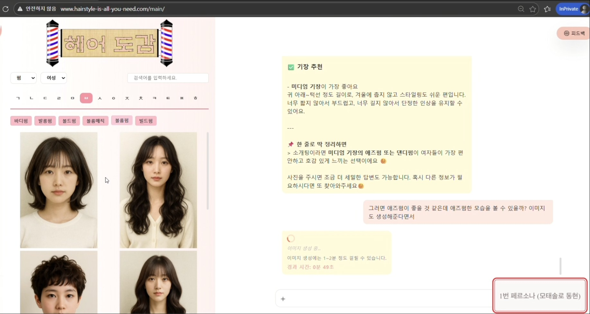
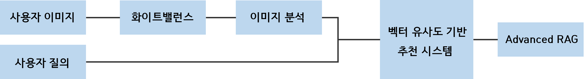
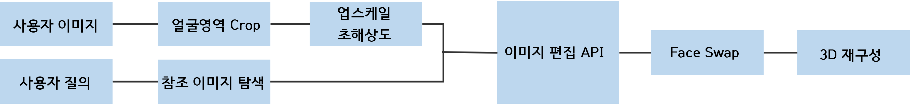

# Hairstyle is All You Need

### Demo

  

 
 

  
  
<em>클릭하여 유튜브에서 시연 영상 보기</em>

 
 

## 목차

1. [프로젝트 배경](#1-프로젝트-배경)
2. [프로젝트 목표](#2-프로젝트-목표)
3. [기술스택](#3-기술스택)
4. [시스템 아키텍처](#4-시스템-아키텍처)
5. [ERD](#5-erd)
6. [핵심 설계](#6-핵심-설계)
7. [모델 선정](#7-모델-선정)
8. [평가](#8-평가)
9. [결과](#9-결과)

 
 

## 1. 프로젝트 배경

 

  
  

 

### 뷰티 산업의 변화

- **개인 맞춤형 서비스에 대한 높은 수요**
  - 맥킨지(2025) 조사: 소비자의 **71%가 개인화된 뷰티 서비스 기대**
  - 기대 미충족 시 **76%가 부정적으로 인식**
  
- **퍼스널 컬러·헤어 컨설팅 서비스 호황**
  - 맞춤형 뷰티 서비스의 수요 급증
  - 개인별 특성을 고려한 상담 서비스 인기

 

  

### 기존 오프라인 서비스의 한계

- **높은 진입장벽**
  - 고가의 비용 (컨설팅당 수만원~수십만원)
  - 1시간 이상의 긴 소요 시간
  - 시간과 장소의 제약

- **VTO(Virtual Try-On) 기술의 부상**
  - 온라인으로 스타일을 가상 체험할 수 있는 기술
  - 의류, 메이크업에서 헤어스타일까지 확대 중

 

### 현재 헤어스타일 온라인 서비스의 문제점

- **서비스 공백 확인**
  - 체험만을 위한 버튼식 UI로 사용자의 취향 파악 불가
  - 면대면 컨설팅을 대체할 대화형 인터페이스의 부재
  - 고퀄리티 가상 체험 제공 서비스 부족

 

### 프로젝트의 필요성

- **비정형 사용자 질의 처리의 어려움**
  - 예시: *"가벼우면서도 러블리하고 너무 짧지는 않고, 가을 느낌이 물씬 나는 헤어스타일이 뭐가 있을까?"*
  - 대화 내 다양하고 복잡한 표현에서 핵심 취향 추출 필요

- **멀티모달 분석 요구**
  - 텍스트(사용자 질의) + 얼굴 이미지 동시 분석
  - 종합적인 맞춤형 추천 및 상담과 가상체험

 

### 솔루션: 이미지-언어 멀티모달 AI 챗봇

**이미지-언어 멀티모달 AI 모델을 활용한 헤어스타일 맞춤 상담 챗봇 개발**
- 미용실에서 스타일링 가능한 다양한 헤어스타일과 컬러 이해
- 자연스러운 대화를 통한 취향 파악
- 얼굴 이미지 분석을 지원하는 맞춤 추천
- 고퀄리티 VTO 기술 통합

 
 

## 2. 프로젝트 목표

### 핵심 목표

본 프로젝트는 **이미지-언어 멀티모달 AI를 활용한 대화형 헤어스타일 추천 및 가상 체험 서비스**를 개발하는 것을 목표로 합니다.

 

### 세부 목표

#### 1️⃣ 대화형 AI 상담 시스템 구축
- **자연어 기반 취향 분석**: 사용자의 비정형적이고 복잡한 요구사항을 자연어로 이해
- **맞춤형 스타일 제안**: 대화를 통해 사용자에게 최적화된 구체적인 헤어스타일 추천
- **직관적인 인터페이스**: 복잡한 메뉴 없이 채팅만으로 간편하게 상담 진행

#### 2️⃣ 생성형 AI 기반 가상 피팅 (VTO)
- **합성 요청 이해**: 사용자의 비정형적이고 복잡한 합성 요청을 자연어로 이해
- **고퀄리티 이미지 생성**: 요청 내용을 바탕으로 요청 헤어스타일을 사용자 얼굴에 적용
- **3차원 체험**: 이미지를 넘어 헤어스타일을 실감할 수 있는 3차원 생성 기술 통합

#### 3️⃣ 최신 트렌드 정보 제공
- **웹 서치 툴 연동**: 실시간으로 최신 헤어스타일 트렌드 검색
- **계절별·연령별 맞춤 정보**: 현재 유행하는 스타일과 트렌드를 반영한 상담
- **지속적인 정보 업데이트**: 변화하는 뷰티 트렌드에 즉각 대응

 
 

## 3. 기술스택

| 카테고리 | 기술스택 |
|---------|---------|
| **언어** |   |
| **프레임워크/라이브러리** |    |
| **프론트엔드** |   |
| **데이터베이스** |  |
| **벡터 데이터베이스** |  |
| **배포/인프라** |      |
| **협업** |  |

 
 

## 4. 시스템 아키텍처

  

 
 

## 5. ERD

  

 
 

## 6. 핵심 설계

### RAG

- 헤어스타일 뷰티 관련 블로그 콘텐츠 크롤링 및 전처리
- 벡터스토어(FAISS) 구축
- 평가를 통한 임베딩 모델 선정 및 리랭커 도입

### 에이전트 구축

- 여러 기능들을 효율적으로 관리할 수 있는 에이전트 구조 설계
- 평가를 통한 멀티모달 에이전트 모델 선정
- 다양한 상황에 대처 가능한 프롬프트 설계 및 최적화
- Tool (헤어스타일 추천, 이미지 생성, 웹 검색) 별 알고리즘 설계 및 개발

### 시스템 구축

- EC2 기반 웹 배포
- FastAPI를 통한 사용자 요청 라우팅
- RDS, S3를 통한 사용자 정보 및 이미지 데이터 관리
- 헤어도감, 갤러리 등 사용자 친화적인 UX를 고려한 프론트엔드 구현 

 
 

### Tool 알고리즘

#### 헤어스타일 추천 알고리즘

  

 

- 화이트밸런스를 통한 원본 이미지의 조명 영향 제거 
- 이미지 분석을 통한 성별, 얼굴형, 피부색 추출
- 퍼스널 컬러 분류 알고리즘을 통한 퍼스널 컬러 추출
- 벡터 유사도 기반 자체 추천 시스템 설계 및 개발
- Advanced RAG를 활용한 추천 헤어스타일 관련 문서 내 Retrieval
 
 
 

#### 이미지 합성 알고리즘

  

 

- 사용자 질의로부터 다양한 카테고리의 요청 키워드 추출
- 얼굴 영역 자동 crop 및 superresolution을 통한 고해상도 이미지 생성
- 얼굴 재생성 문제 완화를 위한 Face Swap 기술 도입
- 3D Reconstruction 기술 적용을 통한 3D 생성 및 렌더링 서비스 구현

 
 

### 상세 설계

- **상세 데이터 구축**: 성별, 얼굴형, 기장, 퍼스널컬러, 계절, 헤어스타일/컬러 별 세분화된 데이터 구축

- **QA 캐시 시스템**: 이전 추천 결과를 벡터스토어에 저장하여 유사 질의 시 빠른 응답 제공

- **기장 인지 알고리즘**: 기장 요청 별 추천 및 합성을 위한 기장 인지 알고리즘 개발 및 프롬프트 설계

- **가중치 기반 추천**: 사용자의 요구사항과 얼굴 분석 정보와의 균형을 맞추기 위한 score 기반 가중치 설계

- **응답 히스토리**: 세션별 대화 컨텍스트 유지

 
 

## 7. 모델 선정
다양한 VLM 모델과 임베딩, 리랭커 모델들을 평가지표 기반 성능 평가를 통해 최적의 모델과 조합을 선정

### RAG

- **임베딩 모델**: dragonkue/snowflake-arctic-embed-l-v2.0-ko
- **리랭커 모델**: Dongjin-kr/ko-reranker
- **Chunk size**: 200
- **Overlap**: 100
- **Top K**: 2

### 에이전트

- **ChatGPT (gpt-5.2-chat-latest)**: 의도 파악 / Tool 호출 / 자연어 생성 / 대화 관리

### 헤어스타일 추천 알고리즘

- **IdentiFace**: 이미지 기반 성별, 얼굴형 추출
- **SkinToneClassifier**: 이미지 기반 피부색 추출

### 헤어스타일 이미지 합성 알고리즘

- **SAFMN**: 원본 해상도로부터 고해상도 이미지 생성
- **GTP-Image-1**: 이미지 편집 API
- **FaceSwap**: 원본 얼굴 유지
- **Face Lift**: Gaussian Splatting 기반 3차원 생성

 
 

## 8. 평가

### Recommendation Evaluation

<table>
  <thead>
    <tr>
      <th style="text-align: center;">평가 항목</th>
      <th style="text-align: center;">평가 종류</th>
      <th style="text-align: center;">평가지표</th>
      <th style="text-align: center;">평가 결과</th>
    </tr>
  </thead>
  <tbody>
    <tr>
      <td rowspan="4" style="text-align: center; vertical-align: middle;"><strong>Retrieval</strong></td>
      <td rowspan="4" style="text-align: center; vertical-align: middle;">정량</td>
      <td style="text-align: center;">Context Recall</td>
      <td style="text-align: center;">0.75</td>
    </tr>
    <tr>
      <td style="text-align: center;">Context Precision</td>
      <td style="text-align: center;">0.94</td>
    </tr>
    <tr>
      <td style="text-align: center;">MRR</td>
      <td style="text-align: center;">0.97</td>
    </tr>
    <tr>
      <td style="text-align: center;">NDCG</td>
      <td style="text-align: center;">0.94</td>
    </tr>
    <tr>
      <td style="text-align: center;"><strong>Generation</strong></td>
      <td style="text-align: center;">정량</td>
      <td style="text-align: center;">Faithfulness</td>
      <td style="text-align: center;">0.91</td>
    </tr>
    <tr>
      <td style="text-align: center;">문장 구사력</td>
      <td style="text-align: center;">정성</td>
      <td style="text-align: center;">자체평가</td>
      <td style="text-align: center;">P</td>
    </tr>
    <tr>
      <td style="text-align: center;">질의 부합성</td>
      <td style="text-align: center;">정성</td>
      <td style="text-align: center;">자체평가</td>
      <td style="text-align: center;">P</td>
    </tr>
    <tr>
      <td style="text-align: center;">할루시네이션</td>
      <td style="text-align: center;">정성</td>
      <td style="text-align: center;">자체평가</td>
      <td style="text-align: center;">P</td>
    </tr>
    <tr>
      <td style="text-align: center;">응답시간</td>
      <td style="text-align: center;">정량</td>
      <td style="text-align: center;"> - </td>
      <td style="text-align: center;">20s</td>
    </tr>
  </tbody>
</table>

 

### Image Generation Evaluation

<table>
  <thead>
    <tr>
      <th style="text-align: center;">평가 항목</th>
      <th style="text-align: center;">평가 종류</th>
      <th style="text-align: center;">평가지표</th>
      <th style="text-align: center;">평가 결과</th>
    </tr>
  </thead>
  <tbody>
    <tr>
      <td style="text-align: center;">이미지 품질</td>
      <td style="text-align: center;">정량</td>
      <td style="text-align: center;">CLIP-IQA</td>
      <td style="text-align: center;">0.82</td>
    </tr>
    <tr>
      <td style="text-align: center;">원본 얼굴 유사도</td>
      <td style="text-align: center;">정량</td>
      <td style="text-align: center;">ArcFace</td>
      <td style="text-align: center;">0.8</td>
    </tr>
    <tr>
      <td style="text-align: center;">질의 부합성</td>
      <td style="text-align: center;">정성</td>
      <td style="text-align: center;">자체평가</td>
      <td style="text-align: center;">P</td>
    </tr>
    <tr>
      <td style="text-align: center;">할루시네이션</td>
      <td style="text-align: center;">정성</td>
      <td style="text-align: center;">자체평가</td>
      <td style="text-align: center;">P</td>
    </tr>
    <tr>
      <td style="text-align: center;">응답시간</td>
      <td style="text-align: center;">정량</td>
      <td style="text-align: center;"> - </td>
      <td style="text-align: center;">60s</td>
    </tr>
  </tbody>
</table>

### 평가 데이터셋 구축

- **Corpus 추출**: VectorStore에서 전체 뷰티 도메인 문서 추출 및 메타데이터 타입별 그룹화
- **Ground Truth 설정**: Corpus에서 샘플링된 원본 문서를 정답(retrieval gt)으로 지정
- **Query 생성**: LLM(GPT-4o)을 활용한 문서 당 검색 쿼리 자동 생성
- **Generation GT 생성**: LLM을 활용한 문서 기반 정답 답변(generation gt) 생성

### 평가 지표 선정

- 에이전트 성능 평가를 위한 자체 정성 평가지표 수립
- Retrieval 평가를 위한 정량 평가지표(Context Recall, Context Precision, MRR, NDCG) 선정
- Generation 평가를 위한 정량 평가지표(Faithfulness, Answer Relevancy) 선정 및 자체 정성 평가지표 수립
- 이미지 생성 성능 평가를 위한 정량 평가지표(CLIP-IQA, ArcFace) 선정
- 응답시간 측정 및 평가

### 최적화

- **Retrieval**: Chunk size, Overlap, Top K 조합별 성능 비교 및 최적 조합 선정
- **Embedding**: 다양한 임베딩 모델 별 Retrieval 성능 비교를 통한 최적 모델 선정 및 리랭커 평가
- **에이전트**: Generation 평가를 통한 에이전트 모델 성능 비교 및 최적 모델 선정

 
 

## 9. 결과

### 성과

- 대화형 상담 UX 구현
- 개인 맞춤형 서비스 제공
- 2D부터 3D까지 확장 가능한 가상 체험 서비스 제공
- 최신 K-뷰티 트렌드 반영

### 향후 개선 방향

- 최신 Face Swap 모델 탐색 및 테스트
- 오픈소스 이미지 생성 모델 탐색 및 적용
- 최신 스타일 자동 업데이트 기능 추가
- 이목구비, 모발 등 세부 요소 인지 기능 개발 
